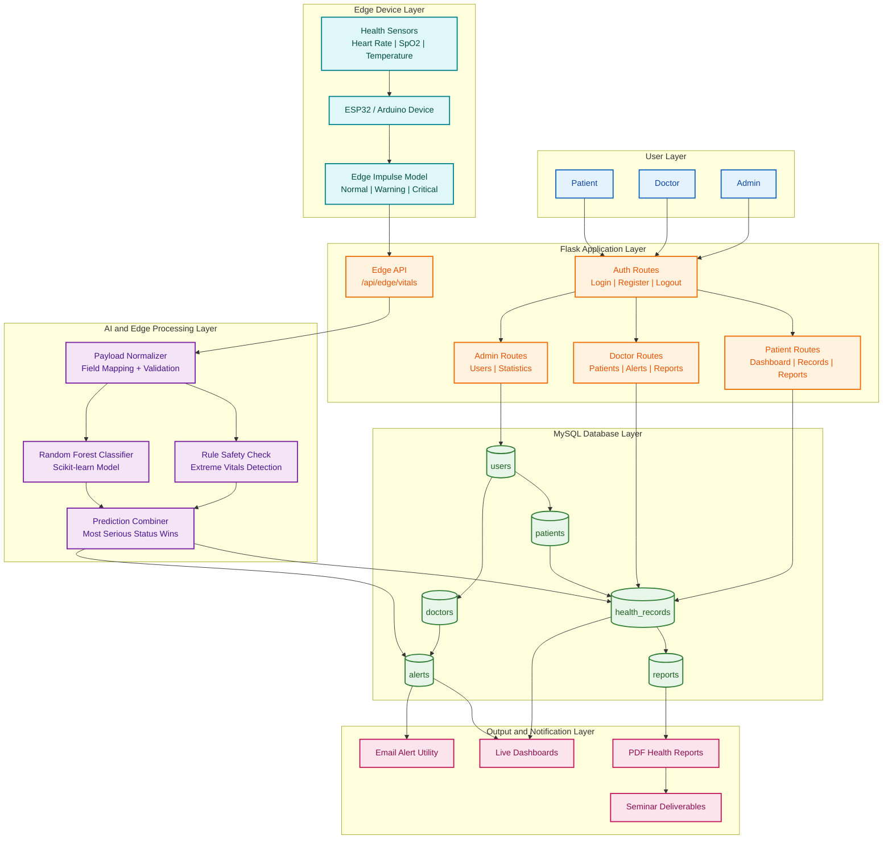
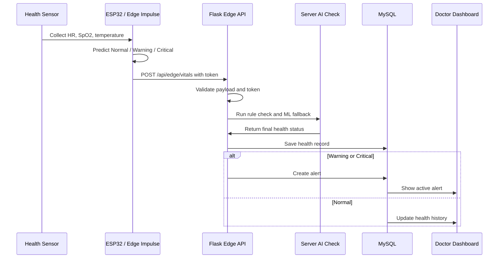

# Smart-Patient-Health-Monitoring-System
A full-stack healthcare monitoring platform with edge computing, AI-based health classification, real-time alerts, role-based dashboards, PDF reports, and Edge Impulse external device integration.
# Smart Patient Health Monitoring System

<div align="center">


**A full-stack healthcare monitoring platform with edge computing, AI-based health classification, real-time alerts, role-based dashboards, PDF reports, and Edge Impulse external device integration.**

Developed by **Aniket Nihal** | 2026

</div>

---

## Table of Contents

- [Overview](#overview)
- [Key Features](#key-features)
- [Architecture Diagram](#architecture-diagram)
- [Workflow](#workflow)
- [Technology Stack](#technology-stack)
- [Project Structure](#project-structure)
- [Database Design](#database-design)
- [Installation and Setup](#installation-and-setup)
- [Demo Login Credentials](#demo-login-credentials)
- [Edge Impulse Integration](#edge-impulse-integration)
- [API Endpoint](#api-endpoint)
- [Seminar Deliverables](#seminar-deliverables)
- [Testing](#testing)
- [Future Scope](#future-scope)

---

## Overview

The **Smart Patient Health Monitoring System** is a healthcare web application designed to monitor patient vitals such as heart rate, body temperature, oxygen level, blood pressure, and glucose level.

The system uses:

- **Flask** for backend logic and routing
- **MySQL** for persistent data storage
- **Scikit-learn Random Forest model** for health status prediction
- **Edge computing module** for local preprocessing and simulated sensor readings
- **Edge Impulse integration** for real external devices such as ESP32 or Arduino
- **Doctor alerts** for warning and critical health conditions
- **PDF reports** for health history and presentation use

Health readings are classified into:

| Status | Meaning |
|---|---|
| `Normal` | Patient vitals are within safe range |
| `Warning` | Vitals need doctor attention |
| `Critical` | Immediate medical attention may be required |

---

## Key Features

| Module | Features |
|---|---|
| Authentication | Patient, doctor, and admin login with bcrypt password hashing |
| Patient Dashboard | Latest health status, vitals, history, charts, alerts |
| Doctor Dashboard | Assigned patients, active alerts, patient detail view |
| Admin Dashboard | User management and system statistics |
| AI Prediction | Health status classification using trained ML model |
| Edge Processing | Sensor simulation, buffering, aggregation, noise filtering |
| Edge Impulse API | External device readings through `/api/edge/vitals` |
| Alerts | Automatic warning and critical alerts for doctors |
| Reports | Health report generation using ReportLab |
| Security | Environment-based credentials and edge device token |

---

## Architecture Diagram



---

## Workflow



---

## Technology Stack

| Layer | Technology |
|---|---|
| Frontend | HTML5, CSS3, JavaScript, Bootstrap 5 |
| Backend | Python, Flask 3.0 |
| Database | MySQL 8.0 |
| Machine Learning | Scikit-learn, Pandas, NumPy, Joblib |
| Edge AI | Edge Impulse, ESP32/Arduino-ready API |
| Reports | ReportLab |
| Security | bcrypt, Flask sessions, `.env` configuration |
| Deployment | Gunicorn, Procfile |

---

## Project Structure

```text
smart_health_monitering/
|-- app.py
|-- config.py
|-- requirements.txt
|-- Procfile
|-- README.md
|-- .env.example
|
|-- ai/
|   |-- train_model.py
|   |-- predict.py
|   |-- health_model.pkl
|
|-- database/
|   |-- schema.sql
|
|-- edge/
|   |-- edge_processor.py
|   |-- sensor_simulator.py
|   |-- edge_impulse.py
|   |-- send_demo_reading.py
|
|-- models/
|   |-- user_model.py
|   |-- patient_model.py
|   |-- doctor_model.py
|
|-- routes/
|   |-- auth.py
|   |-- patient.py
|   |-- doctor.py
|   |-- admin.py
|   |-- pdf_report.py
|   |-- edge_api.py
|
|-- templates/
|   |-- index.html
|   |-- login.html
|   |-- register.html
|   |-- patient_dashboard.html
|   |-- doctor_dashboard.html
|   |-- admin_dashboard.html
|   |-- reports.html
|
|-- static/
|   |-- css/
|   |-- js/
|
|-- docs/
|   |-- EDGE_IMPULSE_SETUP.md
|   |-- ER_diagram.png
|   |-- DFD.png
|
|-- seminar_deliverables/
|   |-- SmartHealth_Seminar_Presentation.pdf
|   |-- SmartHealth_Seminar_Presentation.pptx
|   |-- Edge_Impulse_Features_Step_By_Step.pdf
|   |-- SmartHealth_LinkedIn_Post_Image.png
```

---

## Database Design

The system uses six core tables:

| Table | Purpose |
|---|---|
| `users` | Stores login credentials and role information |
| `doctors` | Stores doctor profile and specialization |
| `patients` | Stores patient profile and assigned doctor |
| `health_records` | Stores all manual, simulated, and edge device vitals |
| `alerts` | Stores warning and critical doctor alerts |
| `reports` | Stores generated report metadata |

Database schema file:

```text
database/schema.sql
```

---

## Installation and Setup

### 1. Clone the repository

```bash
git clone https://github.com/your-username/smart-health-monitoring.git
cd smart-health-monitoring
```

### 2. Create and activate virtual environment

Windows PowerShell:

```powershell
python -m venv .venv
.\.venv\Scripts\Activate.ps1
```

### 3. Install dependencies

```powershell
pip install -r requirements.txt
```

### 4. Create `.env`

Copy `.env.example` to `.env` and update your local values:

```env
SECRET_KEY=change-me
DB_HOST=localhost
DB_PORT=3306
DB_USER=your_mysql_user
DB_PASSWORD=your_mysql_password
DB_NAME=smart_health_db
EDGE_DEVICE_TOKEN=smarthealth-edge-demo-token
```

### 5. Create MySQL database and tables

Run this from the project root:

```powershell
mysql -u your_mysql_user -p < database\schema.sql
```

### 6. Train the ML model if needed

```powershell
python ai\train_model.py
```

### 7. Run the Flask app

```powershell
python app.py
```

Open:

```text
http://127.0.0.1:5000
```

---

## Demo Login Credentials

Seed data in `database/schema.sql` includes demo users:

| Role | Email | Password |
|---|---|---|
| Admin | `admin@smarthealth.com` | `helloworld` |
| Doctor | `doctor@smarthealth.com` | `helloworld` |
| Patient | `patient@smarthealth.com` | `helloworld` |

---

## Edge Impulse Integration

This project supports external live monitoring through Edge Impulse-ready devices.

### Purpose

Edge Impulse is used to train and deploy a lightweight ML model on an external device. The device can classify live sensor readings locally and send the prediction to the Flask app.

### Device flow

1. Sensors collect patient vitals.
2. Edge Impulse model predicts `Normal`, `Warning`, or `Critical`.
3. ESP32/Arduino sends JSON data to Flask.
4. Flask validates the request token.
5. Flask runs server-side safety checks.
6. MySQL stores the health record.
7. Warning or critical status creates a doctor alert.

Setup guide:

```text
docs/EDGE_IMPULSE_SETUP.md
```

Demo without hardware:

```powershell
python edge\send_demo_reading.py --patient-id 1 --mode warning
```

---

## API Endpoint

### Health check

```http
GET /api/edge/health
```

### Send live vitals

```http
POST /api/edge/vitals
Content-Type: application/json
X-Edge-Token: smarthealth-edge-demo-token
```

Example payload:

```json
{
  "patient_id": 1,
  "device_id": "esp32-health-band-01",
  "heart_rate": 96,
  "spo2": 94,
  "temperature": 38.2,
  "bp_systolic": 130,
  "bp_diastolic": 86,
  "glucose": 110,
  "edge_impulse": {
    "label": "Warning",
    "confidence": 0.91
  }
}
```

---

## Seminar Deliverables

| File | Description |
|---|---|
| `seminar_deliverables/SmartHealth_Seminar_Presentation.pptx` | Main seminar presentation |
| `seminar_deliverables/SmartHealth_Seminar_Presentation.pdf` | PDF version of presentation |
| `seminar_deliverables/Edge_Impulse_Features_Step_By_Step.pdf` | Edge Impulse feature explanation |
| `seminar_deliverables/SmartHealth_LinkedIn_Post_Image.png` | LinkedIn post image |

---

## Testing

Run tests after installing `pytest`:

```powershell
pip install pytest
python -m pytest tests\test_system.py -v
```

Basic app verification:

```powershell
python -m compileall app.py routes edge models ai tests
```

---

## Future Scope

- Real ESP32 sensor firmware with Edge Impulse classifier
- Live WebSocket dashboard updates
- SMS or WhatsApp alert integration
- Cloud deployment with managed MySQL
- Doctor appointment scheduling
- Patient mobile application
- More clinical features such as ECG and fall detection

---

## Author

**Aniket Nihal**

Project: Smart Patient Health Monitoring System using Edge Computing  
Year: 2026

---

## License

This project is developed for academic and learning purposes.
